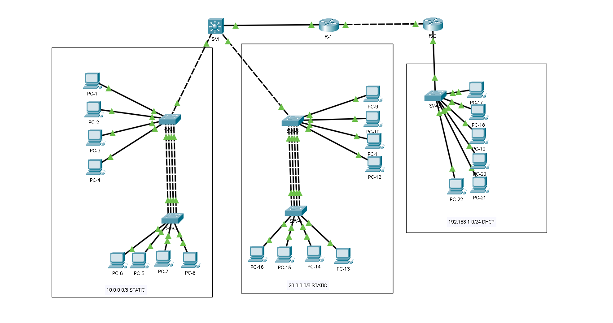

Enrutamiento entre VLAN SVI Cuando desee establecer comunicación entre diferentes VLAN, necesitará un dispositivo que pueda realizar enrutamiento. Puede utilizar un enrutador externo con puertas de enlace físicas independientes o un método de subinterfaz (enrutador en dispositivo), pero también es posible utilizar un conmutador multicapa. 

**Ether-channel or (link aggregation).** Ether-channel es una tecnología que nos permite agrupar múltiples enlaces físicos en un único enlace lógico. El Ether-channel se utiliza para agregar ancho de banda entre múltiples interfaces de capa 2/capa 3.

**Spanning-tree BPDU Guard** es una de las funciones que le ayudan a proteger su topología de árbol de expansión. 

**BPDU Guard** evita bucles si se conecta otro conmutador a un puerto de puerto rápido. 

**The root guard** evita que el interruptor incorrecto se convierta en STP. Si un puerto de root guard recibe una BPDU superior que podría hacer que se convierta en un root port, el puerto se pone en estado "root-inconsistent".



```js
SW-1(config)#interface range fastEthernet 0/5-8
SW-1(config-if-range)#spanning-tree portfast
%Warning: portfast should only be enabled on ports connected to a single
host. Connecting hubs, concentrators, switches, bridges, etc... to this
interface when portfast is enabled, can cause temporary bridging loops.
Use with CAUTION

%Portfast has been configured on FastEthernet0/5 but will only
have effect when the interface is in a non-trunking mode.

%Warning: portfast should only be enabled on ports connected to a single
host. Connecting hubs, concentrators, switches, bridges, etc... to this
interface when portfast is enabled, can cause temporary bridging loops.
Use with CAUTION

%Portfast has been configured on FastEthernet0/6 but will only
have effect when the interface is in a non-trunking mode.

%Warning: portfast should only be enabled on ports connected to a single
host. Connecting hubs, concentrators, switches, bridges, etc... to this
interface when portfast is enabled, can cause temporary bridging loops.
Use with CAUTION

%Portfast has been configured on FastEthernet0/7 but will only
have effect when the interface is in a non-trunking mode.

%Warning: portfast should only be enabled on ports connected to a single
host. Connecting hubs, concentrators, switches, bridges, etc... to this
interface when portfast is enabled, can cause temporary bridging loops.
Use with CAUTION

%Portfast has been configured on FastEthernet0/8 but will only
have effect when the interface is in a non-trunking mode.
SW-1(config-if-range)#end
SW-1#
```

```js
SW-2(config)#interface range f0/5-8
SW-2(config-if-range)#spanning-tree portfast
%Warning: portfast should only be enabled on ports connected to a single
host. Connecting hubs, concentrators, switches, bridges, etc... to this
interface when portfast is enabled, can cause temporary bridging loops.
Use with CAUTION

%Portfast has been configured on FastEthernet0/5 but will only
have effect when the interface is in a non-trunking mode.
%Warning: portfast should only be enabled on ports connected to a single
host. Connecting hubs, concentrators, switches, bridges, etc... to this
interface when portfast is enabled, can cause temporary bridging loops.
Use with CAUTION

%Portfast has been configured on FastEthernet0/6 but will only
have effect when the interface is in a non-trunking mode.
%Warning: portfast should only be enabled on ports connected to a single
host. Connecting hubs, concentrators, switches, bridges, etc... to this
interface when portfast is enabled, can cause temporary bridging loops.
Use with CAUTION

%Portfast has been configured on FastEthernet0/7 but will only
have effect when the interface is in a non-trunking mode.
%Warning: portfast should only be enabled on ports connected to a single
host. Connecting hubs, concentrators, switches, bridges, etc... to this
interface when portfast is enabled, can cause temporary bridging loops.
Use with CAUTION

%Portfast has been configured on FastEthernet0/8 but will only
have effect when the interface is in a non-trunking mode.
SW-2(config-if-range)#end
SW-2#
```

Repita en SW-3 y SW-4

```js
SW-1(config)#interface g0/1
SW-1(config-if)#switchport mode trunk
SW-1(config-if)#exit
```

```js
SW-3(config)#interface g0/1
SW-3(config-if)#switchport mode trunk
SW-3(config-if)#exit
```

```js
SVI(config)#vlan 10
SVI(config-vlan)#name digital-market
SVI(config-vlan)#exit
SVI(config)#vlan 20
SVI(config-vlan)#name customer-care
SVI(config-vlan)#exit
SVI(config)#ip routing
SVI(config)#interface vlan 10
SVI(config-if)#
%LINK-5-CHANGED: Interface Vlan10, changed state to up
%LINEPROTO-5-UPDOWN: Line protocol on Interface Vlan10, changed state to up
SVI(config-if)#ip address 10.1.1.1 255.0.0.0
SVI(config-if)#no sh
SVI(config-if)#exit
SVI(config)#interface vlan 20
SVI(config-if)#
%LINK-5-CHANGED: Interface Vlan20, changed state to up
%LINEPROTO-5-UPDOWN: Line protocol on Interface Vlan20, changed state to up
SVI(config-if)#ip address 20.1.1.1 255.0.0.0
SVI(config-if)#no sh
```

```js
SW-1(config)#interface range f0/1-4
SW-1(config-if-range)#channel-protocol pagp
SW-1(config-if-range)#channel-group 1 mode desirable
SW-1(config-if-range)#
Creating a port-channel interface Port-channel 1

%LINEPROTO-5-UPDOWN: Line protocol on Interface FastEthernet0/1, changed state to down
%LINEPROTO-5-UPDOWN: Line protocol on Interface FastEthernet0/1, changed state to up
%LINEPROTO-5-UPDOWN: Line protocol on Interface FastEthernet0/2, changed state to down
%LINEPROTO-5-UPDOWN: Line protocol on Interface FastEthernet0/2, changed state to up
%LINEPROTO-5-UPDOWN: Line protocol on Interface FastEthernet0/3, changed state to down
%LINEPROTO-5-UPDOWN: Line protocol on Interface FastEthernet0/3, changed state to up
%LINEPROTO-5-UPDOWN: Line protocol on Interface FastEthernet0/4, changed state to down 
%LINEPROTO-5-UPDOWN: Line protocol on Interface FastEthernet0/4, changed state to up

SW-1(config-if-range)#exit
SW-1(config)#
```

```js
SW-2(config)#interface range f0/1-4
SW-2(config-if-range)#channel-protocol pagp
SW-2(config-if-range)#channel-group 1 mode desirable
SW-2(config-if-range)#
Creating a port-channel interface Port-channel 1

%LINEPROTO-5-UPDOWN: Line protocol on Interface FastEthernet0/1, changed state to down
%LINEPROTO-5-UPDOWN: Line protocol on Interface FastEthernet0/1, changed state to up
%LINEPROTO-5-UPDOWN: Line protocol on Interface FastEthernet0/2, changed state to down
%LINEPROTO-5-UPDOWN: Line protocol on Interface FastEthernet0/2, changed state to up
%LINEPROTO-5-UPDOWN: Line protocol on Interface FastEthernet0/3, changed state to down
%LINEPROTO-5-UPDOWN: Line protocol on Interface FastEthernet0/3, changed state to up
%LINEPROTO-5-UPDOWN: Line protocol on Interface FastEthernet0/4, changed state to down 
%LINEPROTO-5-UPDOWN: Line protocol on Interface FastEthernet0/4, changed state to up

SW-2(config-if-range)#exit
SW-2(config)#
```

```js
SW-3(config)#interface range f0/1-4
SW-3(config-if-range)#channel-protocol pagp
SW-3(config-if-range)#channel-group 2 mode desirable
SW-3(config-if-range)#
Creating a port-channel interface Port-channel 2

%LINEPROTO-5-UPDOWN: Line protocol on Interface FastEthernet0/1, changed state to down
%LINEPROTO-5-UPDOWN: Line protocol on Interface FastEthernet0/1, changed state to up
%LINEPROTO-5-UPDOWN: Line protocol on Interface FastEthernet0/2, changed state to down
%LINEPROTO-5-UPDOWN: Line protocol on Interface FastEthernet0/2, changed state to up
%LINEPROTO-5-UPDOWN: Line protocol on Interface FastEthernet0/3, changed state to down
%LINEPROTO-5-UPDOWN: Line protocol on Interface FastEthernet0/3, changed state to up
%LINEPROTO-5-UPDOWN: Line protocol on Interface FastEthernet0/4, changed state to down
%LINEPROTO-5-UPDOWN: Line protocol on Interface FastEthernet0/4, changed state to up

SW-3(config-if-range)#exit
SW-3(config)#
```

```js
SW-4(config)#interface range f0/1-4
SW-4(config-if-range)#channel-protocol pagp
SW-4(config-if-range)#channel-group 2 mode desirable
SW-4(config-if-range)#
Creating a port-channel interface Port-channel 2

%LINEPROTO-5-UPDOWN: Line protocol on Interface FastEthernet0/1, changed state to down
%LINEPROTO-5-UPDOWN: Line protocol on Interface FastEthernet0/1, changed state to up
%LINEPROTO-5-UPDOWN: Line protocol on Interface FastEthernet0/2, changed state to down
%LINEPROTO-5-UPDOWN: Line protocol on Interface FastEthernet0/2, changed state to up
%LINEPROTO-5-UPDOWN: Line protocol on Interface FastEthernet0/3, changed state to down
%LINEPROTO-5-UPDOWN: Line protocol on Interface FastEthernet0/3, changed state to up
%LINEPROTO-5-UPDOWN: Line protocol on Interface FastEthernet0/4, changed state to down
%LINEPROTO-5-UPDOWN: Line protocol on Interface FastEthernet0/4, changed state to up

SW-4(config-if-range)#exit
SW-4(config)#
```

```js
SW-1(config)#interface port-channel 1
SW-1(config-if)#switchport mode trunk
SW-1(config-if)#exit
```

```js
SW-2(config)#interface port-channel 1
SW-2(config-if)#switchport mode trunk
SW-2(config-if)#%SPANTREE-2-UNBLOCK_CONSIST_PORT: Unblocking Port-channel1 on VLAN0001. Port consistency restored.

%SPANTREE-2-UNBLOCK_CONSIST_PORT: Unblocking Port-channel1 on VLAN0001. Port consistency restored.

SW-2(config-if)#exit
```

```js
SW-3(config)#interface port-channel 2
SW-3(config-if)#switchport mode trunk
SW-3(config-if)#exit
```

```js
SW-4(config)#interface port-channel 2
SW-4(config-if)#switchport mode trunk

SW-4(config-if)#%SPANTREE-2-UNBLOCK_CONSIST_PORT: Unblocking Port-channel2 on VLAN0001. Port consistency restored.

%SPANTREE-2-UNBLOCK_CONSIST_PORT: Unblocking Port-channel2 on VLAN0001. Port consistency restored.

SW-4(config-if)#exit
```

```js
SW-1(config)#vlan 10
SW-1(config-vlan)#name digital-market
SW-1(config-vlan)#exit
SW-1(config)#
SW-1(config)#interface range f0/5-8
SW-1(config-if-range)#switchport mode access
SW-1(config-if-range)#switchport access vlan 10
SW-1(config-if-range)#exit
```

```js
SW-2(config)#vlan 10
SW-2(config-vlan)#name digital-market
SW-2(config-vlan)#exit
SW-2(config)#interface range f0/5-8
SW-2(config-if-range)#switchport mode access
SW-2(config-if-range)#switchport access vlan 10
SW-2(config-if-range)#exit
```

```js
SW-3(config)#vlan 20
SW-3(config-vlan)#name customer-care
SW-3(config)#interface range f0/5-8
SW-3(config-if-range)#switchport mode access
SW-3(config-if-range)#switchport access vlan 20
SW-3(config-if-range)#exit
```

```js
SW-4(config)#vlan 20
SW-4(config-vlan)#name customer-care
SW-4(config-vlan)#exit
SW-4(config)#interface range f0/5-8
SW-4(config-if-range)#switchport mode access
SW-4(config-if-range)#switchport access vlan 20
SW-4(config-if-range)#exit
```

```js
SW-1(config)#interface range f0/5-8
SW-1(config-if-range)#spanning-tree bpduguard enable
SW-1(config-if-range)#exit
```

```js
SW-2(config)#interface range f0/5-8
SW-2(config-if-range)#spanning-tree bpduguard enable
SW-2(config-if-range)#exit
```

```js
SVI(config)#interface g1/0/1
SVI(config-if)#no switchport
SVI(config-if)#ip address 1.1.1.2 255.0.0.0
SVI(config-if)#no sh
SVI(config-if)#exit
```

```js
R-1(config)#interface g0/0/1
R-1(config-if)#ip address 1.1.1.1 255.0.0.0
R-1(config-if)#no sh
R-1(config-if)#

%LINK-5-CHANGED: Interface GigabitEthernet0/0/1, changed state to up

%LINEPROTO-5-UPDOWN: Line protocol on Interface GigabitEthernet0/0/1, changed state to up

Router(config-if)#exit
```

```js
R-1(config)#interface g0/0/1
R-1(config-if)#ip address 192.168.1.1 255.255.255.0
R-1(config-if)#no sh
R-1(config-if)#

%LINK-5-CHANGED: Interface GigabitEthernet0/0/1, changed state to up 

%LINEPROTO-5-UPDOWN: Line protocol on Interface GigabitEthernet0/0/1, changed state to up

R-2(config-if)#exit
R-2(config)#ip dhcp pool server
R-2(dhcp-config)#network 192.168.1.0 255.255.255.0
R-2(dhcp-config)#dns-server 192.168.1.80
R-2(dhcp-config)#exit
R-2(config)#ip dhcp excluded-address 192.168.1.1
R-2(config)#ip dhcp excluded-address 192.168.1.80
R-2(config)#exit

R-2(config)#interface g0/0/0
R-2(config-if)#ip address 2.2.2.2 255.0.0.0
R-2(config-if)#no sh
R-2(config-if)#

%LINK-5-CHANGED: Interface GigabitEthernet0/0/0, changed state to up

R-2(config-if)#exit
```

```js
SW-5(config)#ip dhcp snooping
SW-5(config)#ip dhcp snooping vlan 1
SW-5(config)#interface g0/1
SW-5(config-if)#ip dhcp snooping trust
SW-5(config-if)#exit
```

```js
R-2(config)#ip dhcp relay information trust-all
R-2(config)#exit
```

```js
R-1(config)#interface gigabitEthernet 0/0/0
R-1(config-if)#ip address 2.2.2.1 255.0.0.0
R-1(config-if)#no sh

R-1(config-if)#

%LINK-5-CHANGED: Interface GigabitEthernet0/0/0, changed state to up

%LINEPROTO-5-UPDOWN: Line protocol on Interface GigabitEthernet0/0/0, changed state to up

Router(config-if)#
```

```js
R-2(config)#router eigrp 1
R-2(config-router)#network 192.168.1.0
R-2(config-router)#network 2.0.0.0
R-2(config-router)#no auto-summary
R-2(config-router)#exit
```

```js
R-1(config)#router eigrp 1
R-1(config-router)#network 2.0.0.0
R-1(config-router)#

%DUAL-5-NBRCHANGE: IP-EIGRP 1: Neighbor 2.2.2.2 (GigabitEthernet0/0/0) is up: new adjacency

R-1(config-router)#network 1.0.0.0
R-1(config-router)#no auto-summary
R-1(config-router)#exit
```

```js
SVI(config)#router eigrp 1
SVI(config-router)#network 1.0.0.0
SVI(config-router)#network 10.0.0.0
SVI(config-router)#network 20.0.0.0
SVI(config-router)#no auto-summary
SVI(config-router)#exit
```